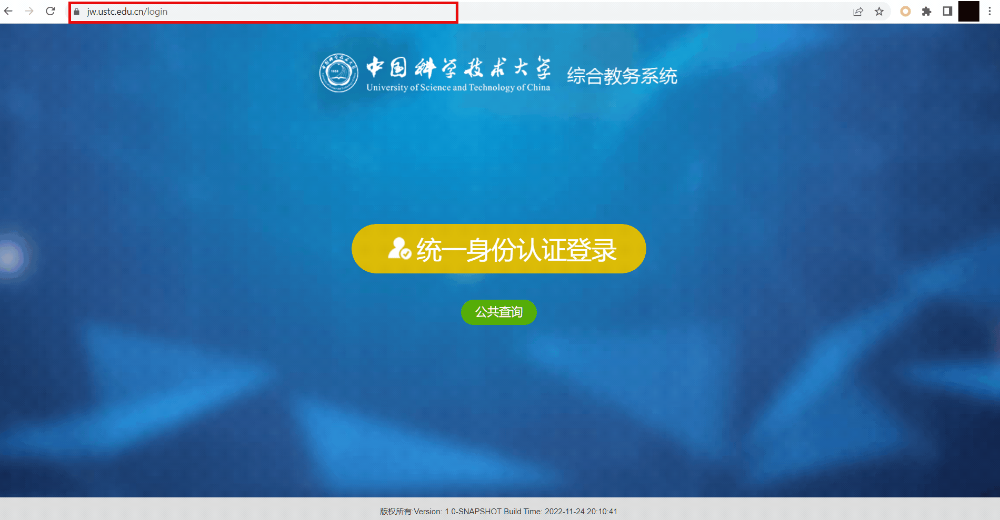
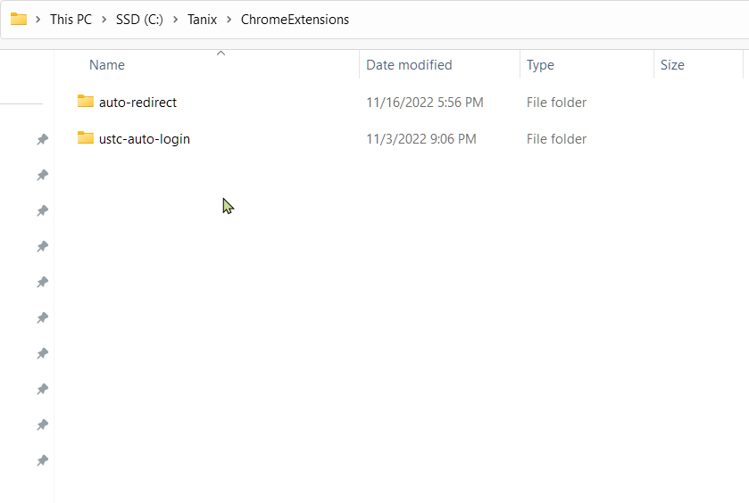
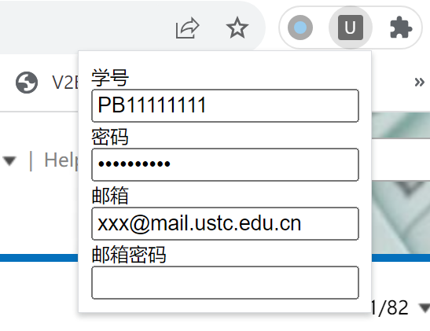
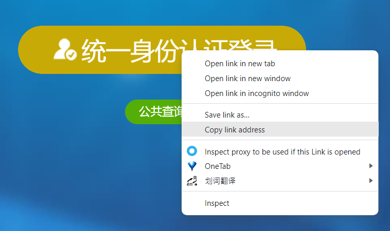

# ustc-auto-login

## 功能

- 统一身份认证系统自动登录
- 邮箱系统自动登录

## 使用方法

1. 点击右侧Releases中的Latest，下载Assets中的ustc-auto-login.zip，将其解压到文件夹ustc-auto-login中，注意ustc-auto-login文件夹以后不能删除或移动，建议剪切到合适位置
   
   

2. 进入插件设置界面，打开开发者模式，加载已解压的扩展程序，选择ustc-auto-login文件夹安装扩展
   
   

3. 点击浏览器右上角扩展按钮，下拉栏中点击“USTC自动登录”插件，在弹出窗口中输入学号、密码、邮箱和邮箱密码（邮箱密码留空，则其使用密码），会自动保存
   
   

## 如何添加自动登录书签

USTC邮件系统使用指定链接：https://mail.ustc.edu.cn/

其他需要统一身份认证的地方右键复制其链接，如教务系统为：https://jw.ustc.edu.cn/ucas-sso/login

